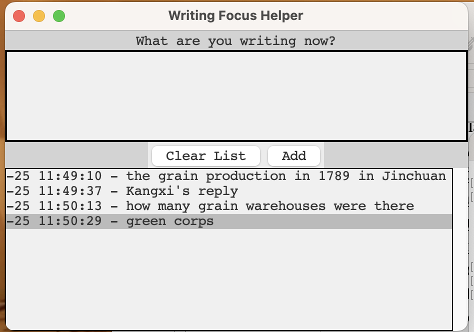

a screenshot of the _Writing Logger_

LLMs can be seen as free interpreters that allow people without coding knowledge to communicate with and give commands to machines. I began to write small programs that helped with my writing process with the help of LLM. 

The first tool I created was _Writing Logger_. The goal is simple: to help my easily distracted mind stay focused on what I am writing—and what I’m about to write. I used a mix of tools: Claude from Anthropic, OpenAI’s ChatGPT, X AI’s Grok, and some good old human help from coding friends.

The current design is quite old-fashioned—it might remind you of a 90s Windows system. But it works. You write down what you're working on right now every so often—the more concrete, the better. It's usually an idea, a thing, a point. For example: ``the environment of the Columbia River,`` or ``the weather on the day I met someone.`` After logging this ``one idea`` you then type in the next thing you're going to write.

The mechanism is simple: by logging what you're writing,

1. you can remind yourself what you were working on—say, when you've been distracted for a few minutes;
2. the writing log helps bring you back to the core idea you're trying to get across.

The idea for this Writing Logger came from my own frustrating writing habits: I get distracted so easily, even before finishing a single sentence. And as a historian, I constantly need to refer to primary sources. For instance, when reading a memorial written by a Qing official to Kangxi, I might be looking for something about grain production in one county. But then I get sidetracked by the official’s account of transportation issues. It’s a “good” distraction—it might spark new questions about Qing infrastructure—but for the writing process itself, it’s a disaster. I might fall down a rabbit hole in the sea of sources and end up writing nothing relevant to what I should be writing.
