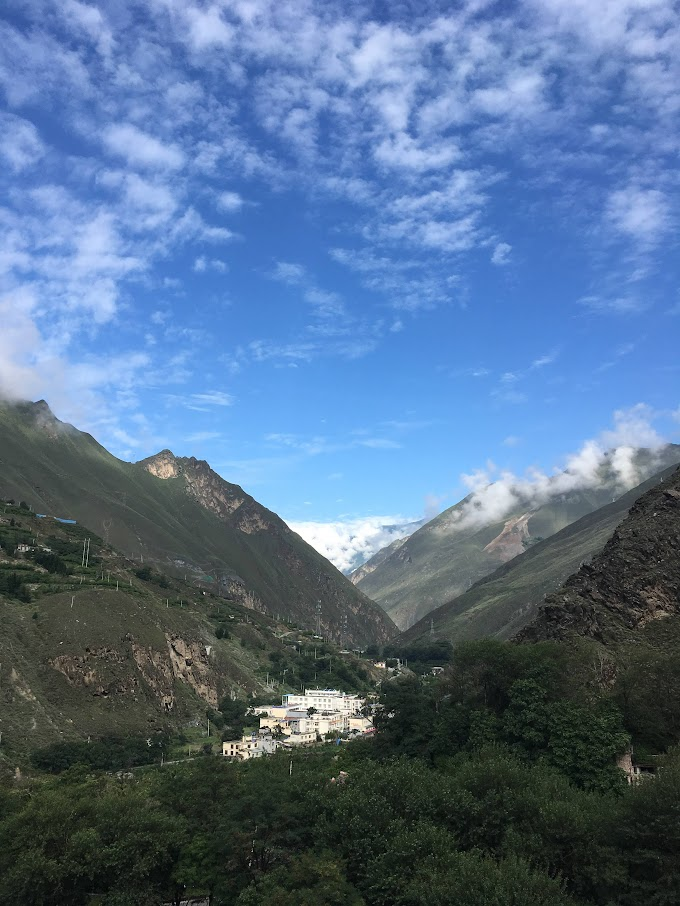

I am a postdoctoral fellow at the Oxford School of Global and Area Studies. I study history of medicine, science, and the environment. I enjoy doing fieldwork in western China, mainly the Upper Min River region in Sichuan province. I am currently writing a monograph on the life stories of medicine gatherers of Chinese medicines.

<figure>
  
  <figcaption>A glimpse of the Min River Valley, Sichuan, China. Photo taken during fieldwork, 2019.</figcaption>
</figure>
